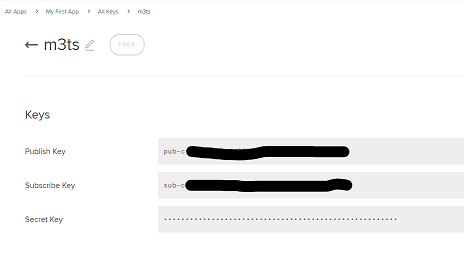

# Bachelor Thesis - Mobile Table Tennis Tracking System (M3TS)

[](https://sonarcloud.io/dashboard?id=sverbach_fmo-android)
[](https://sonarcloud.io/dashboard?id=sverbach_fmo-android)

## Goal
The bachelor thesis' goal is to develop a system which automatically keeps track of a ping pong match (like a "virtual referee"). 


The system must run on two mobile phones:

- One smartphone is the "tracker" -> it films the ping pong table and does the tracking
- The other smartphone is the "display" -> it displays the trackers state (match status) to the players

## Demo
Checkout this demo on youtube for a first impression of the system (turn on subtitles for ENG captions):
https://www.youtube.com/watch?v=QaV0DVbXExA

## Get it running
To get the app running, simply clone this repo and open it in Android Studio.
After Android Studio installed all dependencies via Gradle, you should be good to go for using the app.

### Using Replays
You can let the app apply the object detection (and game logic) on recordings.

To do that on a custom recording, you need to:

1. Create a 720p (1280x720) recording
2. Save it onto the emulator via adb push:
```console
adb push path/to/recording.mp4 /storage/emulated/0/DCIM/camera
```
3. Create an XML file which tells the app where the corners of the tables (and net) are, save it to the Assets Folder (*./app/src/main/assets*)
```xml
<?xml version="1.0" encoding="utf-8" ?>
<!DOCTYPE properties SYSTEM "http://java.sun.com/dtd/properties.dtd">
<properties>
    <entry key="c1_x">65</entry>    <!-- X Position of left corner-->
    <entry key="c1_y">580</entry>   <!-- Y Position of left corner-->
    <entry key="c2_x">1162</entry>  <!-- X Position of right corner-->
    <entry key="c2_y">560</entry>   <!-- Y Position of right corner-->
    <entry key="n1_x">624</entry>   <!-- X Position of net (middle) -->
    <entry key="n1_y">565</entry>   <!-- Y Position of net -->
</properties>
```
4. Done! The video should appear in the dropdown in the replay activity.

**Be warned:** This feature is very experimental and currently only works on the **Nexus 6 API 26 Emulator** (for some reason)!

### Using the app w/ PubNub
We've implemented a feature which allows communication between display and tracker via [PubNub](https://www.pubnub.com/)

To use this feature, you'll have to provide your pubnub API keys to the project.
For that simply:

1. Create a [PubNub Account](https://www.pubnub.com)
2. Generate a KeySet in your accounts admin panel



3. Create a file called **app.properties** and save it to the apps Assets Folder (*./app/src/main/assets*)
4. Paste your Pub & Sub Keys in there as follows (do NOT push this file!):
```properties
pub_key=pub-c-your-publish-key-here
sub_key=sub-c-your-subscribe-key-here
```
5. Done! Now you can use PubNub for means of communication between the 2 devices (enable it in the apps settings if you haven't already)

## Architecture
Brief description of the architecture to assist further development.
### Object Detection / Tracking
Is done using the [FMO (Fast Moving Object) Android implementation](https://github.com/hrabalik/fmo-android). Basically a JNI which gets called each time the library finds detections.
### CI
This project uses SonarQube for code quality inspection.

You can find the panel here: https://sonarcloud.io/dashboard?id=sverbach_fmo-android

### Workflows
Each time a commit is pushed into master, a GitHub Actions workflow is triggered to run all unit tests and to build & run the app.

Workflows are defined here: https://github.com/sverbach/m3ts/actions

## Maintainers
As mentioned before this project is being developed as a bachelor thesis by [ZHAW School of Engineering](https://www.zhaw.ch) and:

- Christian Studer  (studech3@students.zhaw.ch | [chrisslazzz](https://github.com/chrisslazzz))
- Sven Erbach       (erbacsve@students.zhaw.ch | [sverbach](https://github.com/sverbach))
